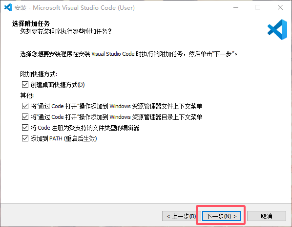
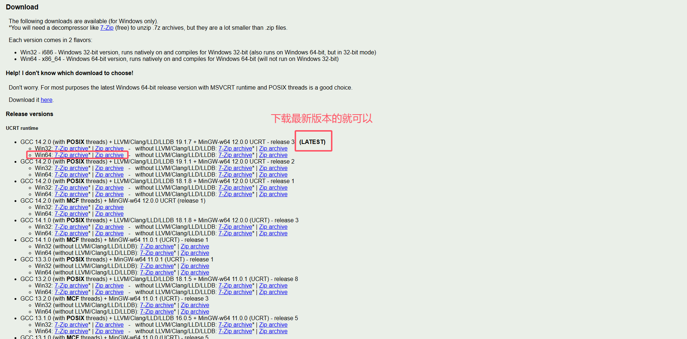
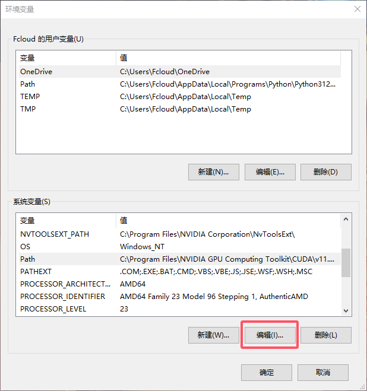
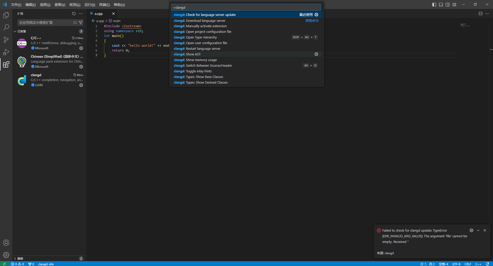
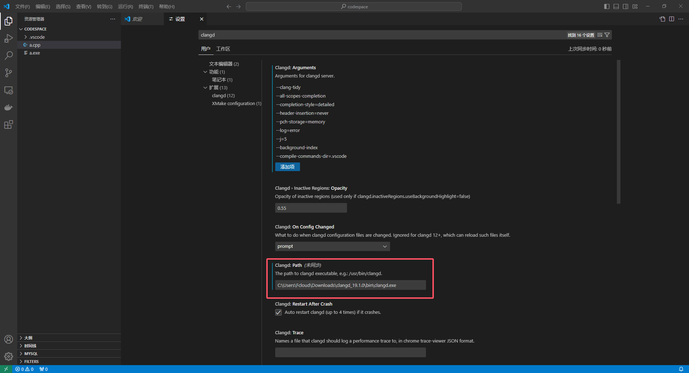

## 前言
本文将手把手教你如何在Windows上配置Visual Studio Code（以下简称VS Code）并将其用于编写、调试运行单文件C/C++程序，如果你的操作系统环境是Linux或Mac OS，请阅读[官方文档](https://code.visualstudio.com/Docs)进行配置。 

## 安装Visual Studio Code
在[官网](https://code.visualstudio.com/)根据你的操作系统下载Visual Studio Code，如果你是Windows 7系统，在[这里](https://code.visualstudio.com/updates/v1_70)下载最后一个支持Windows 7的版本。

打开刚才下载的安装包，保持默认选项一路点确定即可：


这里可以将选项全部勾选：




安装完成后打开VS Code，点击左侧栏拓展按钮，搜索“Chinese”下载中文语言包，等待下载完成后点击弹出来的重启按钮，之后VS Code的语言将会变更为中文。


## 安装MinGW-W64
事实上，VS Code是一个编辑器而非IDE，只有编辑器是无法像Visual Studio、CLion等IDE一样编译C/C++代码的，因此我们需要安装一个编译器。在Windows上我们推荐安装MinGW-W64（注意是MinGW-W64不是MinGW）作为编译器。MinGW是GNU工具（包括GCC、GNU binutils和GDB等）在Windows上的一个移植，但是它仅支持32位，而MinGW-W64是MinGW的一个分支，它提供了64位支持[^1]。

[^1]: [[科普][FAQ]MinGW vs MinGW-W64及其它](https://github.com/FrankHB/pl-docs/blob/master/zh-CN/mingw-vs-mingw-v64.md)

MinGW-W64有多个发行版本如mingw-builds、MSYS2、LLVM-MinGW等，这里我们推荐下载由[WinLibs](https://winlibs.com/)提供的整合包，它包含了GCC与LLVM的一系列设施以及一些附加工具。



如果你因为网络原因难以从WinLibs上下载，你也可以到[山东大学镜像站](https://mirrors.sdu.edu.cn/github-release/niXman_mingw-builds-binaries/)下载由[mingw-builds](https://github.com/niXman/mingw-builds-binaries/releases)发布的版本（POSIX线程模型+SEH异常处理方法+UCRT运行库）。

下载完后得到一个拓展名为.7z的压缩包，解压后得到的就是MinGW-W64本体，把它放在一个你能找到的位置比如C盘根目录下面（不管放到哪里，路径不要含有中文防止出现奇怪的错误）。

接下来将它添加到Path，右键“此电脑”——属性——高级系统设置——环境变量：


选择系统变量下的Path一栏点击：编辑——新建，将刚才解压得到的MinGW文件夹里的bin文件夹路径写进去（如：C:\mingw64\bin）保存后MinGW就被添加到了Path里面。




保存更改之后打开Windows终端（或者你也可以在VS Code里点击终端——新建终端）输入：
```bash
gcc -v
```
回车后你将会看见关于GCC的版本信息，如果提示“'gcc'不是内部或外部命令，也不是可运行的程序或批处理文件。”可尝试重启电脑，若仍出现该消息，说明没有成功添加到Path，请检查是否出现了拼写错误或路径错误。

## 配置Visual Studio Code
首先，我们下载C/C++插件提供C/C++语言的代码补全、高亮、格式化、调试等功能。在拓展应用商店界面搜索C/C++并下载。


为了便于使用，我们通常会在一个文件夹内编写代码，你可以选择一个没有中文的路径新建一个文件夹用于编写代码，在VS Code内点击左上角的：文件——打开文件夹，选择你用于编写代码的文件夹，接下来在其中新建一个.vscode文件夹，在.vscode文件夹下新建tasks.json和launch.json两个文件。


接下来我们来对编译与调试功能进行配置。在tasks.json中粘贴如下内容：
```json
{
    "tasks": [
        {
            "type": "cppbuild",
            "label": "g++ build and debug", // 编译C++的task，供launch.json使用
            "command": "g++", // 使用的编译器
            "args": [ // 下面是编译参数
                "-fdiagnostics-color=always", // 强制编译器在输出错误和警告信息时使用颜色，便于阅读
                "-g", // 生成调试信息
                "-Wall", // 启用所有警告
                "-std=c++23", // 使用C++23作为语言标准
                "-DLOCAL", // （可选）定义宏LOCAL
                "-O2", //（可选）开启O2优化
                "${file}",
                "-o",
                "${fileDirname}/${fileBasenameNoExtension}"
            ],
            "options": {
                "cwd": ""
            },
            "problemMatcher": [
                "$gcc"
            ],
            "group": {
                "kind": "build",
                "isDefault": true
            },
            "presentation": {
                "echo": true,
                "reveal": "always",
                "focus": true,
                "panel": "new"
            },
            "detail": "调试器生成的任务。"
        },
        {
            "type": "cppbuild",
            "label": "gcc build and debug", // 编译C的task，供launch.json使用
            "command": "gcc", // 使用的编译器
            "args": [
                "-fdiagnostics-color=always", // 强制编译器在输出错误和警告信息时使用颜色，便于阅读
                "-g", // 生成调试信息
                "-Wall", // 启用所有警告
                "-std=c17", // 使用C17作为标准进行编译
                "-DLOCAL", // （可选）定义宏__LOCAL__
                "-lm", // 链接到数学库
                "-O2", //（可选）开启O2优化
                "${file}",
                "-o",
                "${fileDirname}/${fileBasenameNoExtension}"
            ],
            "options": {
                "cwd": ""
            },
            "problemMatcher": [
                "$gcc"
            ],
            "group": {
                "kind": "build",
                "isDefault": true
            },
            "detail": "调试器生成的任务。"
        }
    ],
    "version": "2.0.0"
}
```

在launch.json中粘贴如下内容：
```json
{
    "version": "0.2.0",
    "configurations": [
        {
            "name": "g++", // 你可以自定义这个名字
            "type": "cppdbg",
            "request": "launch",
            "program": "${fileDirname}/${fileBasenameNoExtension}",
            "args": [], // 要传递给程序的命令行参数，此处为空
            "stopAtEntry": false, // 设置为true会在程序入口处停止
            "cwd": "${fileDirname}",
            "environment": [], // 可以在这里定义环境变量，此处为空
            "externalConsole": false, // 设置为true会使用外部终端来运行程序，而不是VSCode内部终端
            "MIMode": "gdb",
            "setupCommands": [
                {
                    "description": "为 gdb 启用整齐打印",
                    "text": "-enable-pretty-printing",
                    "ignoreFailures": true
                },
                {
                    "description": "将反汇编风格设置为 Intel",
                    "text": "-gdb-set disassembly-flavor intel",
                    "ignoreFailures": true
                },
                {
                    "description": "不进入标准库内部", // 根据需要添加
                    "text": "-interpreter-exec console \"skip -rfu std::.*\"",
                    "ignoreFailures": true
                }
            ],
            "preLaunchTask": "g++ build and debug" // 在启动调试之前要执行的编译任务，要与tasks.json里的label对应
        },
        {
            "name": "gcc",
            "type": "cppdbg",
            "request": "launch",
            "program": "${fileDirname}/${fileBasenameNoExtension}",
            "args": [],
            "stopAtEntry": false,
            "cwd": "${fileDirname}",
            "environment": [],
            "externalConsole": false,
            "MIMode": "gdb",
            "setupCommands": [
                {
                    "description": "为 gdb 启用整齐打印",
                    "text": "-enable-pretty-printing",
                    "ignoreFailures": true
                },
                {
                    "description": "将反汇编风格设置为 Intel",
                    "text": "-gdb-set disassembly-flavor intel",
                    "ignoreFailures": true
                }
            ],
            "preLaunchTask": "gcc build and debug"
        }
    ]
}
```

现在我们可以一键编译、运行和调试C/C++代码了，打开C/C++文件，点击左侧栏的运行和调试按钮，我们可以选择g++或gcc两个配置选项。对于C++我们选择g++，对于C我们选择gcc，点击绿色三角即可开始编译调试，你也可以通过键盘快捷键F5进行调试或者Ctrl+F5以非调试模式运行（此时断点不生效）。实际上tasks.json和launch.json有更多的配置选项，具体可以到[官方文档](https://code.visualstudio.com/docs/cpp/launch-json-reference)内查看。


:::warning
请务必选择正确的配置选项运行，否则将出现编译器报错。

如果终端提示
```
无法生成和调试，因为活动文件不是 C 或 C++ 源文件。

 *  终端进程启动失败(退出代码: -1)。 
 *  终端将被任务重用，按任意键关闭。
```
并弹出报错窗口，说明你尝试编译运行的不是C/C++文件，请确保当前选中的标签页是C/C++文件。
:::

C/C++插件的可供选择的功能十分丰富，具体可以点击左下角齿轮——设置——搜索“C_Cpp”筛选出设置选项，你也可以对VS Code的其他设置选项进行自定义。


## 使用clangd作为语言服务器
LSP即Language Server Protocol，是由微软推出的编辑器或IDE与语言服务器之间使用的协议，语言服务器提供自动补全、转到定义、查找所有引用等语言功能，同时具有较小的性能开销。如果你觉得C/C++插件不够好用，我们推荐使用clangd作为C/C++的语言服务器以提供上述的功能，事实上CLion使用的语言服务器之一就是clangd。

拓展商店里搜索“clangd”并下载，下载完后会弹出窗口询问是否要禁用C/C++插件的IntelliSense，因为我们的目的就是使用clangd提供IntelliSense等功能，点击Disable IntelliSense。


clangd插件仅提供了一个前端，现在需要我们安装clangd后端。如果你使用的是WinLibs提供的附带LLVM的MinGW-W64，那么只需要在VS Code的设置里面搜索“Clangd: Path”，然后填入C:\mingw64\bin\clangd.exe（也就是你存放MinGW-W64的路径）即可。

你也可以按F1呼出VS Code的命令窗口，输入“clangd”，选择“clangd: Download language server”，clangd插件会开始下载clangd后端。



如果出现网络问题下载失败可以尝试在[GitHub](https://github.com/clangd/clangd/releases)上下载Windows平台的clangd，下载并解压后将其中的bin文件夹内的clangd.exe路径填写到clangd插件设置的Path项中。



安装完clangd后可以对clangd进行一些设置，在设置界面点击右上角“打开设置（json）”打开VS Code的json配置文件，将以下内容粘贴进去（仅粘贴clangd部分的设置到大括号内即可）：
```json
{
    "workbench.colorTheme": "Default Dark+",
    "C_Cpp.intelliSenseEngine": "disabled",
    "clangd.arguments": [
        "--clang-tidy", // 启用Clang-tidy进行代码分析和修复建议
        "--all-scopes-completion", // 开启全局范围内的代码补全，提供更全面的建议
        "--header-insertion=never", // 禁止自动添加头文件
        "--pch-storage=memory", // 使用内存存储预编译头文件，以提高速度
        "--log=error", // 日志级别设置为error
        "--j=5", // 设置同时处理的任务数量
        "--background-index", // 启用后台索引以提升代码导航性能
        "--compile-commands-dir=.vscode" // 指定compile_commands.json的目录
    ],
    "clangd.fallbackFlags": [ // 若没有compile_commands.json时的设置
        "--target=x86_64-w64-mingw" 
    ],
    "editor.defaultFormatter": "llvm-vs-code-extensions.vscode-clangd", // 使用clangd作为格式化工具
}
```

clangd同时也可以格式化你的代码，这只需要在项目文件夹的根目录下新建一个.clang-format文件即可，我们给出一个参考：
```yaml
# 语言: None, Cpp, Java, JavaScript, ObjC, Proto, TableGen, TextProto
Language: Cpp

# 基于LLVM的风格
BasedOnStyle: LLVM

# 访问说明符(public、private等)的偏移
AccessModifierOffset: -4

# 开括号(开圆括号、开尖括号、开方括号)后的对齐: Align, DontAlign, AlwaysBreak(总是在开括号后换行)
AlignAfterOpenBracket: Align

# 连续赋值时，对齐所有等号
AlignConsecutiveAssignments: false

# 连续声明时，对齐所有声明的变量名
AlignConsecutiveDeclarations: false

# 右对齐逃脱换行(使用反斜杠换行)的反斜杠
AlignEscapedNewlines: Right

# 水平对齐二元和三元表达式的操作数
AlignOperands: true

# 对齐连续的尾随的注释
AlignTrailingComments: true

# 不允许函数声明的所有参数在放在下一行
AllowAllParametersOfDeclarationOnNextLine: false

# 不允许短的块放在同一行
AllowShortBlocksOnASingleLine: true

# 允许短的case标签放在同一行
AllowShortCaseLabelsOnASingleLine: true

# 允许短的函数放在同一行: None, InlineOnly(定义在类中), Empty(空函数), Inline(定义在类中，空函数), All
AllowShortFunctionsOnASingleLine: Inline

# 允许短的if语句保持在同一行
AllowShortIfStatementsOnASingleLine: false

# 允许短的循环保持在同一行
AllowShortLoopsOnASingleLine: false

# 总是在返回类型后换行: None, All, TopLevel(顶级函数，不包括在类中的函数), 
# AllDefinitions(所有的定义，不包括声明), TopLevelDefinitions(所有的顶级函数的定义)
AlwaysBreakAfterReturnType: None

# 总是在多行string字面量前换行
AlwaysBreakBeforeMultilineStrings: false

# 总是在template声明后换行
AlwaysBreakTemplateDeclarations: true

# false表示函数实参要么都在同一行，要么都各自一行
BinPackArguments: true

# false表示所有形参要么都在同一行，要么都各自一行
BinPackParameters: true

# 大括号换行，只有当BreakBeforeBraces设置为Custom时才有效
BraceWrapping:
  # class定义后面
  AfterClass: false
  # 控制语句后面
  AfterControlStatement: false
  # enum定义后面
  AfterEnum: false
  # 函数定义后面
  AfterFunction: false
  # 命名空间定义后面
  AfterNamespace: false
  # struct定义后面
  AfterStruct: false
  # union定义后面
  AfterUnion: false
  # extern之后
  AfterExternBlock: false
  # catch之前
  BeforeCatch: false
  # else之前
  BeforeElse: false
  # 缩进大括号
  IndentBraces: false
  # 分离空函数
  SplitEmptyFunction: false
  # 分离空语句
  SplitEmptyRecord: false
  # 分离空命名空间
  SplitEmptyNamespace: false

# 在二元运算符前换行: None(在操作符后换行), NonAssignment(在非赋值的操作符前换行), All(在操作符前换行)
BreakBeforeBinaryOperators: NonAssignment

# 在大括号前换行: Attach(始终将大括号附加到周围的上下文), Linux(除函数、命名空间和类定义，与Attach类似), 
#   Mozilla(除枚举、函数、记录定义，与Attach类似), Stroustrup(除函数定义、catch、else，与Attach类似), 
#   Allman(总是在大括号前换行), GNU(总是在大括号前换行，并对于控制语句的大括号增加额外的缩进), WebKit(在函数前换行), Custom
#   注：这里认为语句块也属于函数
BreakBeforeBraces: Custom

# 在三元运算符前换行
BreakBeforeTernaryOperators: false

# 在构造函数的初始化列表的冒号后换行
BreakConstructorInitializers: AfterColon

#BreakInheritanceList: AfterColon

BreakStringLiterals: false

# 每行字符的限制，0表示没有限制
ColumnLimit: 0

CompactNamespaces: true

# 构造函数的初始化列表要么都在同一行，要么都各自一行
ConstructorInitializerAllOnOneLineOrOnePerLine: false

# 构造函数的初始化列表的缩进宽度
ConstructorInitializerIndentWidth: 4

# 延续的行的缩进宽度
ContinuationIndentWidth: 4

# 去除C++11的列表初始化的大括号{后和}前的空格
Cpp11BracedListStyle: true

# 继承最常用的指针和引用的对齐方式
DerivePointerAlignment: false

# 固定命名空间注释
FixNamespaceComments: true

# 缩进case标签
IndentCaseLabels: true

IndentPPDirectives: None

# 缩进宽度
IndentWidth: 4

# 函数返回类型换行时，缩进函数声明或函数定义的函数名
IndentWrappedFunctionNames: false

# 保留在块开始处的空行
KeepEmptyLinesAtTheStartOfBlocks: true

# 连续空行的最大数量
MaxEmptyLinesToKeep: 1

# 命名空间的缩进: None, Inner(缩进嵌套的命名空间中的内容), All
NamespaceIndentation: None

# 指针和引用的对齐: Left, Right, Middle
PointerAlignment: Right

# 允许重新排版注释
ReflowComments: false

# 允许排序#include
SortIncludes: false

# 允许排序 using 声明
SortUsingDeclarations: false

# 在C风格类型转换后添加空格
SpaceAfterCStyleCast: false

# 在Template 关键字后面添加空格
SpaceAfterTemplateKeyword: true

# 在赋值运算符之前添加空格
SpaceBeforeAssignmentOperators: true

# SpaceBeforeCpp11BracedList: true

# SpaceBeforeCtorInitializerColon: true

# SpaceBeforeInheritanceColon: true

# 开圆括号之前添加一个空格: Never, ControlStatements, Always
SpaceBeforeParens: ControlStatements

# SpaceBeforeRangeBasedForLoopColon: true

# 在空的圆括号中添加空格
SpaceInEmptyParentheses: false

# 在尾随的评论前添加的空格数(只适用于//)
SpacesBeforeTrailingComments: 1

# 在尖括号的<后和>前添加空格
SpacesInAngles: false

# 在C风格类型转换的括号中添加空格
SpacesInCStyleCastParentheses: false

# 在容器(ObjC和JavaScript的数组和字典等)字面量中添加空格
SpacesInContainerLiterals: true

# 在圆括号的(后和)前添加空格
SpacesInParentheses: false

# 在方括号的[后和]前添加空格，lamda表达式和未指明大小的数组的声明不受影响
SpacesInSquareBrackets: false

# 标准: Cpp03, Cpp11, Auto
Standard: Auto

# tab宽度
TabWidth: 4

# 使用tab字符: Never, ForIndentation, ForContinuationAndIndentation, Always
UseTab: Never
```

有时clangd的检查过于严格，会在我们认为不需要进行修改的地方标黄色波浪线（Warning），虽然我们应当小心谨慎地编写规范的代码，但有时确实无法完全按照标准去写~~懒得改~~，此时我们可以对clangd的配置文件进行修改以去掉刺眼的波浪线。按F1呼出VS Code的命令窗口，输入“clangd”，选择“Open user configuration file”打开config.yaml配置文件加入配置信息（或者在代码文件夹根目录下新建一个.clangd文件），我们给出一个例子以供参考：
```yaml
CompileFlags: # 编译标志
  Add: [
	"-std=c++23", # C++标准
    "-Wall", # 启用所有警告
    "-Wno-unused-but-set-variable", # 禁用警告存在未使用的变量
    "-DLOCAL", # 定义宏LOCAL
  ]
  Remove: [
    "-Werror", # 移除将所有警告作为错误的选项
  ]
Diagnostics: # 诊断设置
  UnusedIncludes: None # 禁用警告存在未使用的头文件
  Suppress: 
    pp_including_mainfile_in_preamble # 禁用警告存在头文件递归包含
  ClangTidy:
    Remove: 
      misc-definitions-in-headers
```

配置文件根据具体需要进行修改。

现在我们已经可以愉快地使用clangd了，如果你想了解如何更好地配置clangd，可以查阅[clangd官网](https://clangd.llvm.org/)。

## 使用预编译头文件
使用万能头文件<bits/stdc++.h>会降低编译速度，我们可以使用预编译头文件来提高编译速度。

打开<bits/stdc++.h>所在的文件夹（如：C:\mingw64\include\c++\14.2.0\x86_64-w64-mingw32\bits）右键-在终端中打开，或着使用cd命令移动到该路径，输入编译命令（必须和编译C++代码的编译参数保持一致）：
```bash
g++ -g -std=c++23 -Wall stdc++.h -o stdc++.h.gch
```

为了测试是否使用了预编译头文件，在编译参数里面加上-H参数，例如：
```bash
g++ -H -g -std=c++23 -Wall test.cpp -o test.exe
```

如果看见了下面的输出则说明成果使用了预编译头文件，否则没有，重新检查编译参数是否一致。
```bash
! C:/mingw64/include/c++/14.2.0/x86_64-w64-mingw32/bits/stdc++.h.gch
```

## 还可以做到更多
VS Code可以被用来做更多的事情，你不仅可以用VS Code的Remote-SSH插件进入Linux的世界来编写C/C++、Rust等语言的大型项目，还可以用它来编写Markdown、LaTeX文档，甚至可以用它来玩远古时代的游戏！而这一切都仅仅只需要你学会合理地**STFW**[^2]与**RTFM**[^3]，如果遇到了靠STFW与RTFM难以解决的问题，你也可以向他人请教，但在这之前请先学会[提问的智慧](https://github.com/ryanhanwu/How-To-Ask-Questions-The-Smart-Way/blob/main/README-zh_CN.md)与[别像弱智一样提问](https://github.com/tangx/Stop-Ask-Questions-The-Stupid-Ways/blob/master/README.md)。

[^2]: Search The ~~Friendly~~ Fucking Web
[^3]: Read The ~~Friendly~~ Fucking Manual